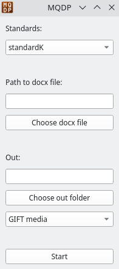

 
# Что это?

`MQDP` (Moodle Questions Document Parser) - это скрипт, который поможет перевести вопросы для тестов из формата `word` в формат [`GIFT media`](https://docs.moodle.org/311/en/Gift_with_medias_format) для `Moodle`. Если картинки не используются в вопросах, то плагин `GIFT media` можно не использовать. Для вопросов без изображений годится обычный `GIFT`.

# Как пользоваться

Всего доступно 7 типов вопросов:

- `О` - Один выбор


- `М` - Множественный выбор


- `К` - Краткий ответ


- `Ф` - Фифти-фифти


- `С` - Сопоставление


- `Ч` - Число


- `Э` - Эссе


Также разработаны `стандарты`, придёрживаясь которых можно формировать вопросы для тестов в `docx-файлах`, а на выходе получать файл, который "съест" `Moodle`, с установленным плагином `GIFT media`. Если же в вопросах не используются изображения (картинки), то плагин можно не устанавливать. На данный момент доступны стандарты:

- ---> [`standartK`](./standartsMD/standartK.md) <--- **тык**

- ыыыыыыыыыыыыыыыыыыыыыыыы

Чтобы скрипт работал правильно, необходимо полностью придерживаться данных стандартов.

После запуска появится окно, где предложат выбрать `стандарт`, `docx-файл` и `выходную директорию`, где будет итоговый файл.



`docx-файл` должен быть составлен в соответствии стандарту.

Содержимов `выходной директории` определяется стандартом и может отличаться от стандарта к стандарту.

# Установка

## Windows

ыыыыыыыыыыыыыыыы

## Linux

### Зависимости

Для работы нужно установить пакеты `bs4`, `lxml` и `PyQt5`:

``` bash
> python -m pip install --upgrade pip

> pip3 install bs4

> pip3 install lxml

> pip3 install PyQt5
```

### Запуск

``` bash
> git clone https://github.com/The220th/MQDP

> cd MQDP

> python3 MQDP.py
```

