# standartK

`standartk` позволяет записывать вопросы в виде таблицы.

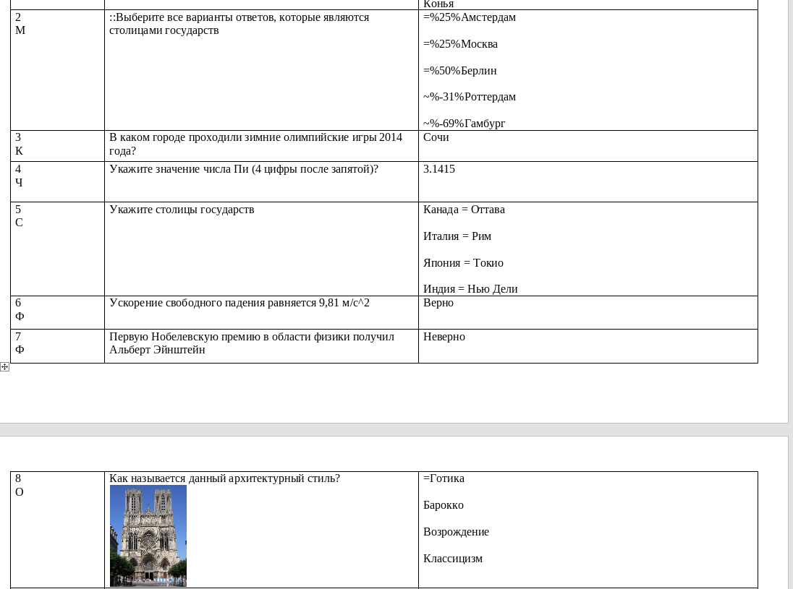


# Правила

## Все вопросы в таблице

К таблице предъявляются следующие требования.

- В документе должна быть хотя бы 1 таблица

- Таблица должна состоять из 3 столбцов

- Таблица должна иметь в первой строке названия колонок. Название может быть каким угодно, например: `"Вопрос"`, `"Текст вопроса"` и `"Варианты ответов"`.

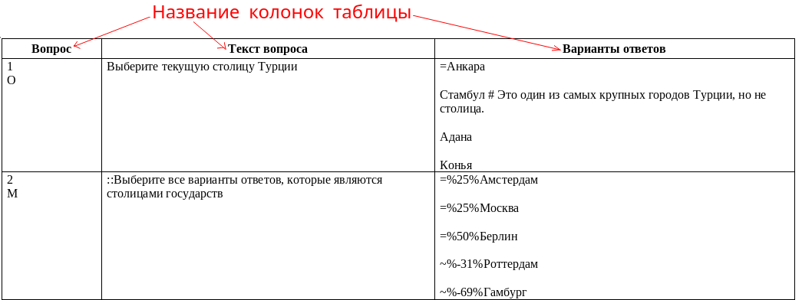

- Количество таблиц с вопросами и ответами неограниченно. Главное, чтобы была хотя бы одна. Название в первой строке должно быть **только** у первой таблицы.

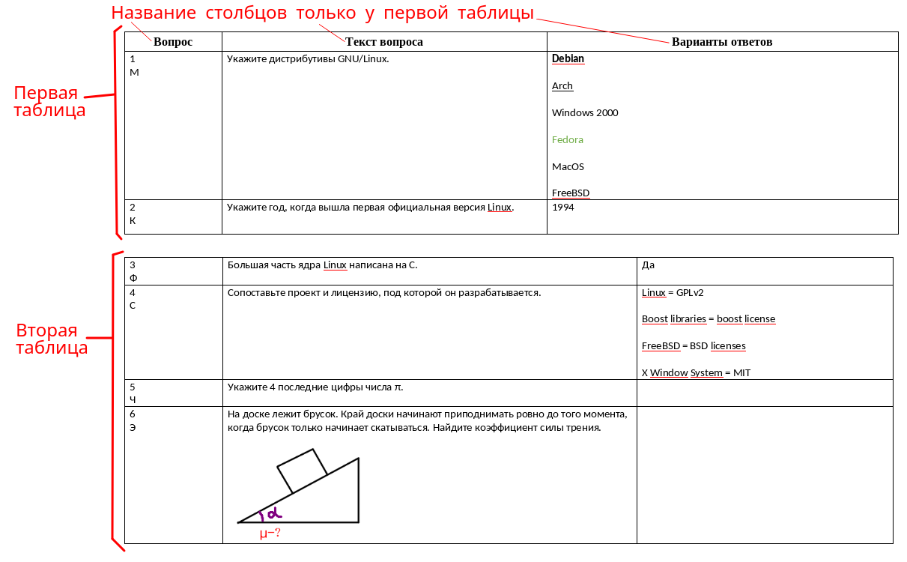

- Ячейки таблиц могут быть любого размера.

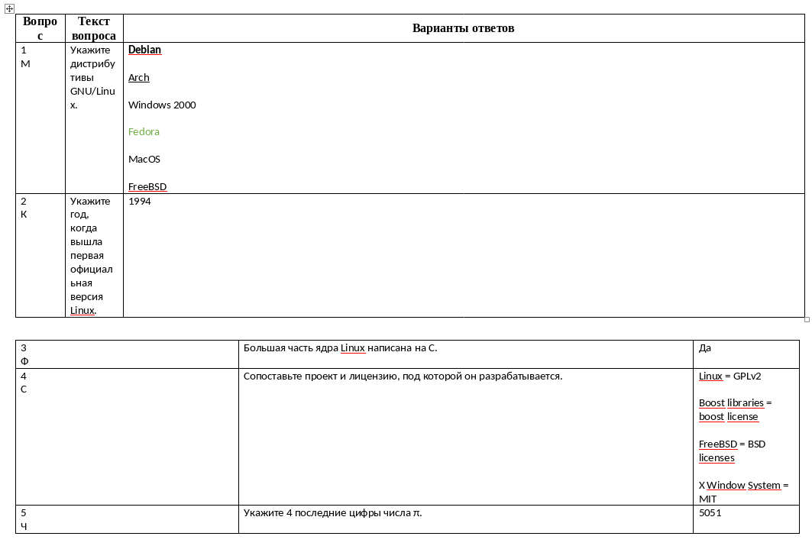

- В первом столбце каждой строки таблицы (кроме самой первой) должен быть указан [тип вопроса](#тип-вопроса): `О`, `М`, `К`, `Ф`, `С`, `Ч`, `Э`.

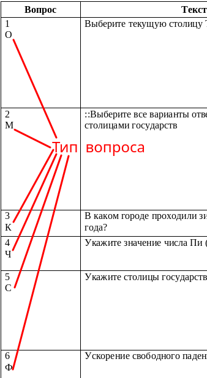

- Во второй столбце указывается сам вопрос.

- В третьем столбце нужно указать вариант(ы) ответа(ов).

## Ориентация

Использовать можно и альбомную, и обычную ориентацию.

## Нежелательные символы в вопросе

Символы: `~`, `=`, `#`, `{`, `}`, `:` - не желательны в вопросах.

## Markdown style

Чтобы перенести в результате (в выходном файле) строку, нужно использовать хотя бы 2 `Enter'а`.

Например:

``` txt
Строка 1
Строка 2

Строка 3

Строка 4
```

Будет выглядеть как:

``` txt
Строка 1Строка 2
Строка 3
Строка 4
```

## Картинки

Картинки обязательно должны быть отдельно от текста и на новой строке. На них тоже распространяется `Markdown style`.

Например, если ячейка выглядит так:

``` txt
Текст 1.
[Картинка 1]
Текст 2.

Текст 3.

[Картинка 2]

Текст 4.
```

То на выходе будет следующее:

``` txt
Текст 1.[Картинка 1]Текст 2.

Текст 3.
[Картинка 2]
Текст 4.
```

Уменьшая картинки в ворде, уменьшение картинок на выходе не будет. То есть, при составлении вопросов можно картинку очень сильно уменьшить, но в выходном файле она будет в полном размере.

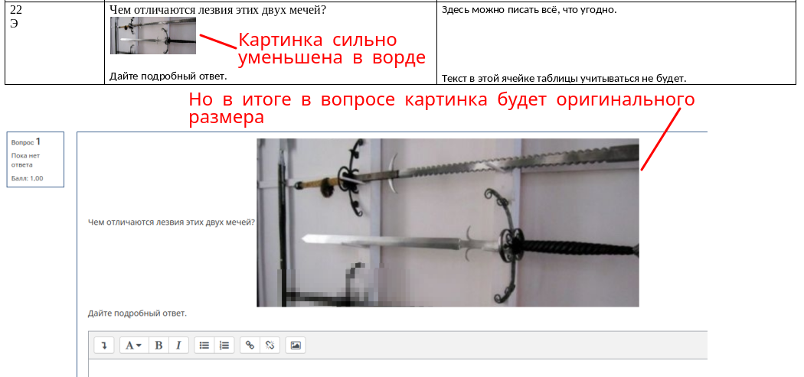

## Обозначение правильных ответов

Правильные ответы обозначаются:

- знаком `равно` перед правильным ответом

- выделением жирным

- подчёркиванием

- зелёным цветом

- любая комбинация из перечисленных выше

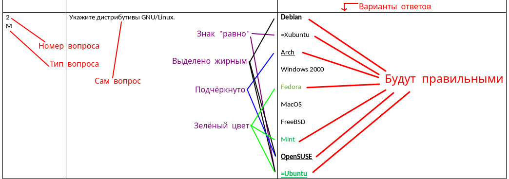

Достаточно выделить один символ жирным, курсивом, подчёркиванием и тд, чтобы считалось, что вся строка жирная, курсивная, подчёркнутая и тд.

### Если правильный ответ - это картинка

Если правильный вариант ответа состоит `только` из картинки, то такой ответ нужно обязательно сопроводить знаком `равно`.

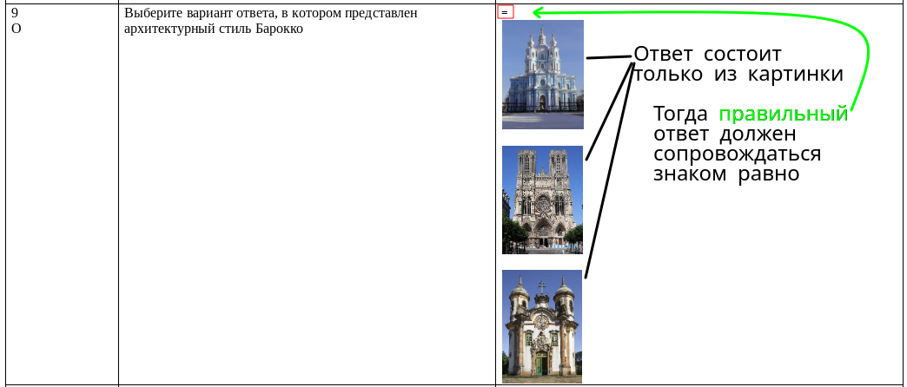

## Тип вопроса

В третьем столбце таблицы указывается вопрос

Всего доступно 7 типов вопросов:

- `О` - **О**дин выбор

- `М` - **М**ножественный выбор

- `К` - **К**раткий ответ

- `Ф` - **Ф**ифти-фифти (верно-неверно)

- `С` - **С**опоставление

- `Ч` - **Ч**исловой ответ

- `Э` - **Э**ссе

### Один выбор

Для обозначение такого вопроса в первом столбце укажите букву `О` или `о` (русская раскладка).

Нужно указать только один правильный ответ в третьем столбце.

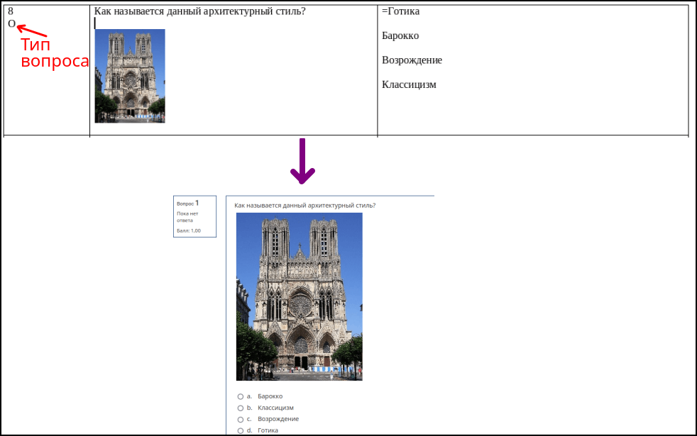

### Множественный выбор

Для обозначение такого вопроса в первом столбце укажите букву `М` или `м` (русская раскладка).

Нужно указать несколько правильных ответов в третьем столбце.

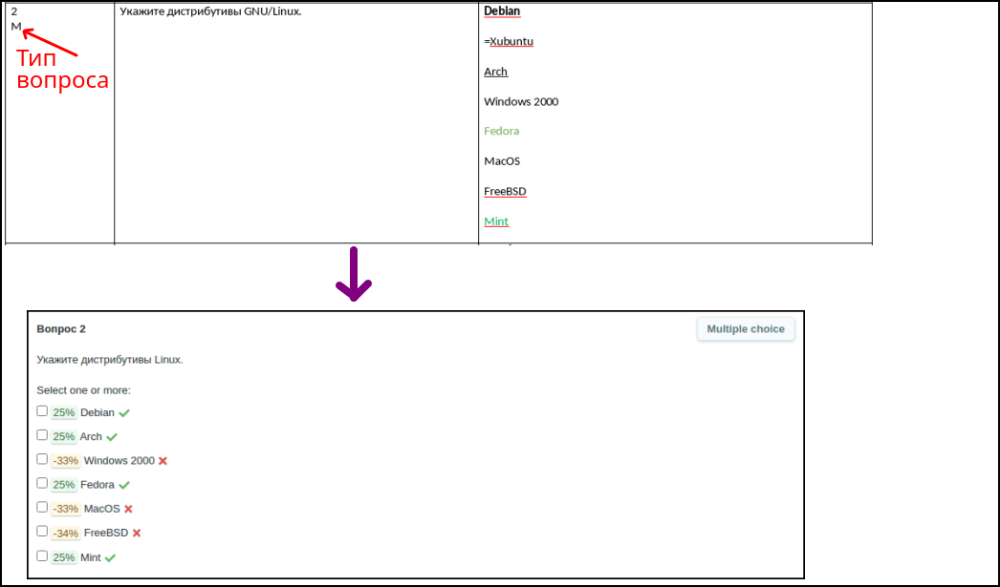

Если явным образом не указаны проценты за вариант ответа, то проценты будут расставлены автоматически.

Можно явным образом указать проценты за каждый вариант ответа. Убедитесь, что сумма будет равна для правильных ответов `100%`, а для неправильных `-100%`.

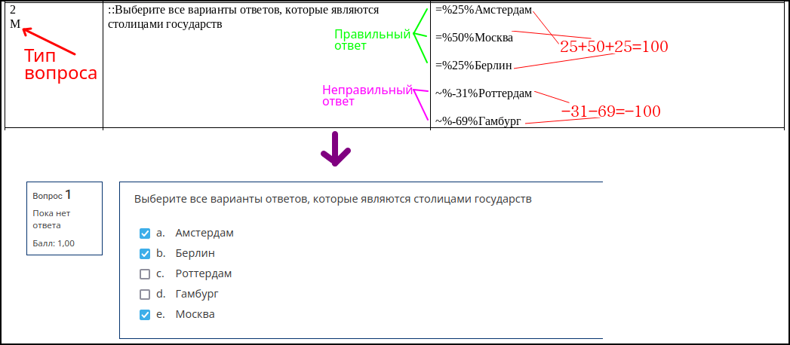

### Краткий ответ

Для обозначение такого вопроса в первом столбце укажите букву `К` или `к` (русская раскладка).

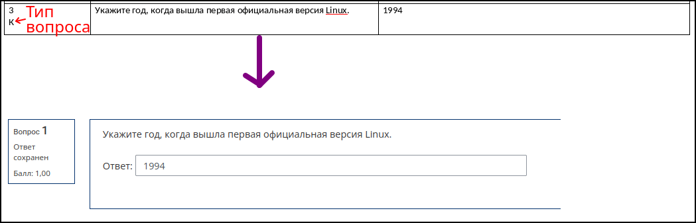

Вполне может быть несколько ответов. Тогда можно явным образом указать это. Нужно дописать проценты к каждому варианту ответа явным образов.

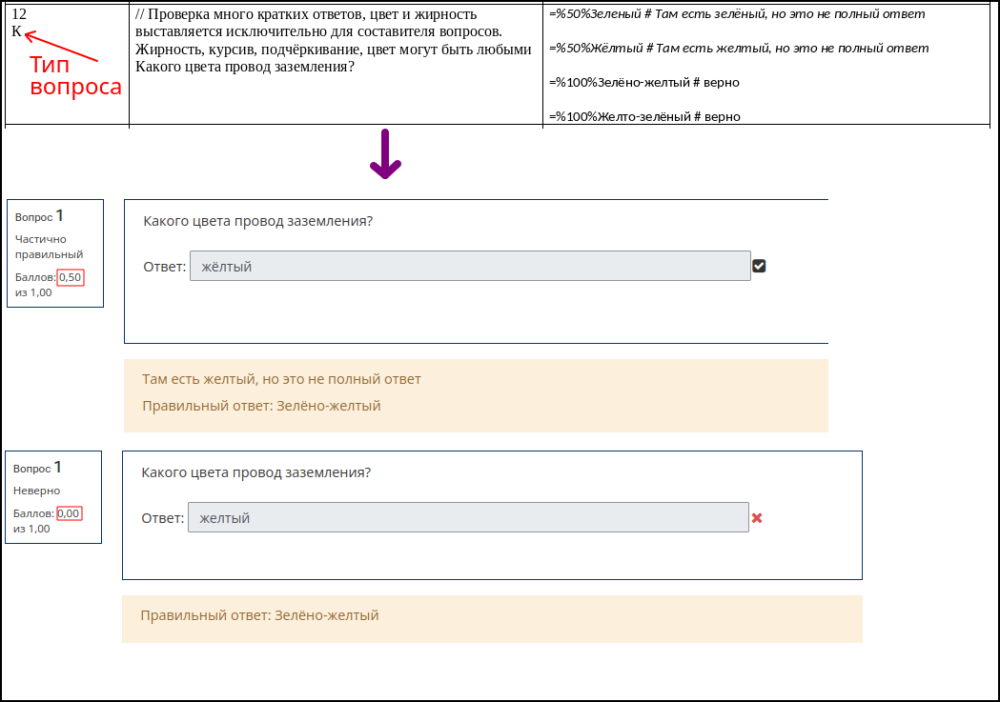

В примере выше в вопросе возникает проблема с буквой `ё`. Мудл считает, что `е` и `ё` - это разные буквы.

### Фифти-фифти (верно-неверно)

Для обозначение такого вопроса в первом столбце укажите букву `Ф` или `ф` (русская раскладка).

Обозначение в третьем столбце, что ответ верный: `Верно`, `верно`, `да`, `Да`, `1`.

Обозначение в третьем столбце, что ответ неверный: `Неверно`, `неверно`, `нет`, `Нет`, `0`.

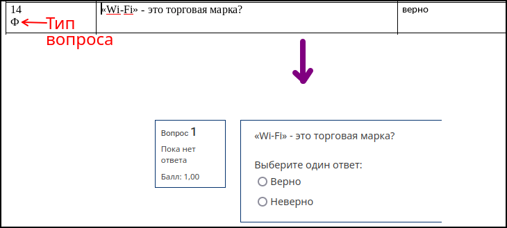

### Сопоставление

Для обозначение такого вопроса в первом столбце укажите букву `С` или `с` (русская раскладка).

Чтобы сопоставить одно с другим используйте `равно`.

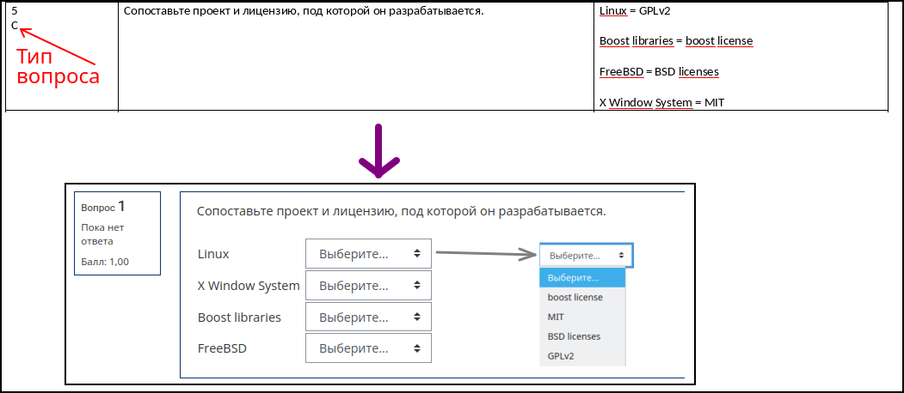

### Числовой ответ

Для обозначение такого вопроса в первом столбце укажите букву `Ч` или `ч` (русская раскладка).

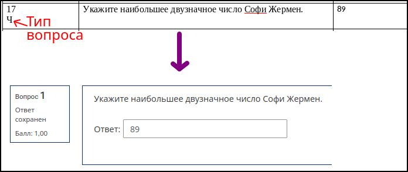

Для чисел с плавущей запятой можно указывать погрешность следующими способами:

- Две или три точки: `...`, `..`. Например, если нужно, чтобы число было в диапазоне от `3.141` *включительно* до `3.142` *включительно*, то подойдёт такая запись: `3.141..3.142` или такая `3.141...3.142`. Причём не важно сколько пробелов: `3,141 ... 3,142` - такая запись тоже будет верной. Важно учесть ещё то, что ворд может три точки `...` превратить в один символ `…`.

- Процент `%`. Например, если нужно, чтобы ответ был от `3.1415 - 0.0005` *включительно* до `3.1415 + 0.0005` *включительно*.

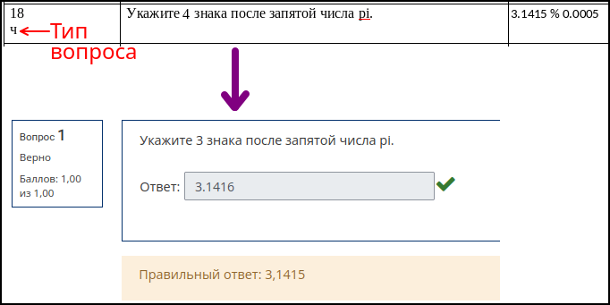

Для чисел с плавующей запятой не важно что используется `запятая` или `точка`. Можно и то, и то использовать.

### Эссе

Для обозначение такого вопроса в первом столбце укажите букву `Э` или `э` (русская раскладка).

Эссе - это вопрос с развёрнутым ответом.

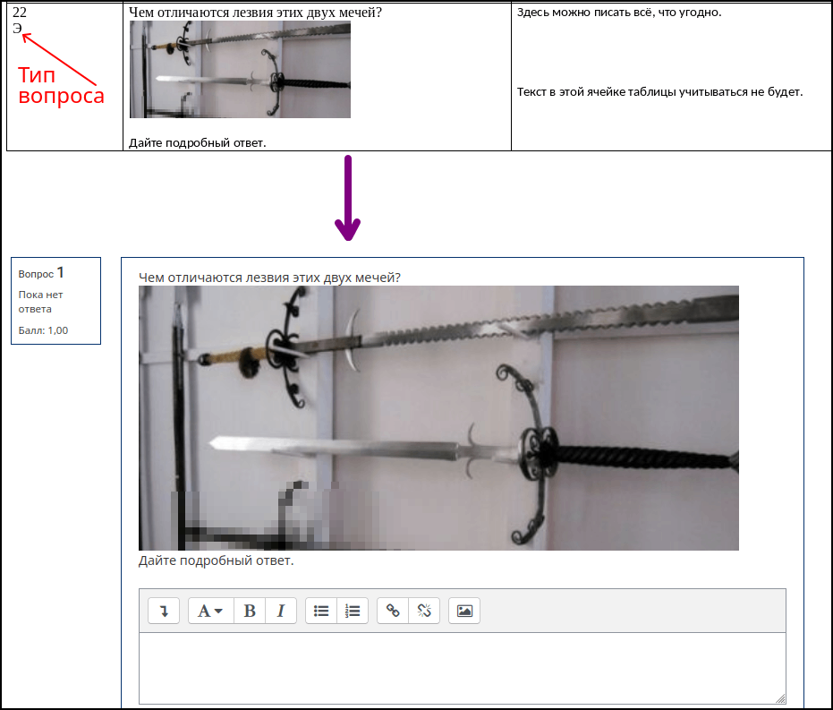